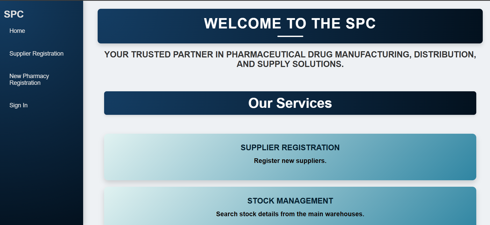

# 💊 State Pharmaceutical Cooperation (SPC) - SOA System  

✨ **A modern SOA solution for pharmaceutical supply chain management**  
*Built with .NET SOAP APIs, MySQL, and cross-platform clients*  

  

---

## 🚀 **Key Features**  

| Feature                | Description                                                                 | Screenshot                          |
|------------------------|-----------------------------------------------------------------------------|-------------------------------------|
| **🔧 Supplier Registration** | Register suppliers via web or SPC branches.                                 |  |
| **📦 Stock Management**     | Real-time inventory updates from plants/warehouses.                         |       |
| **🔍 Drug Search & Order**  | Pharmacies search/order drugs via unified APIs.                             |       |

---

## 🛠 **Tech Stack**  

- **🌐 Backend**: `.NET 6 + WCF (SOAP)`  
- **🗃 Database**: `MySQL 8.0`  
- **📱 Clients**: `ASP.NET MVC (Web)`, `WinForms (Desktop)`  
- **📡 API**: `XML/SOAP` for cross-platform compatibility  

---
