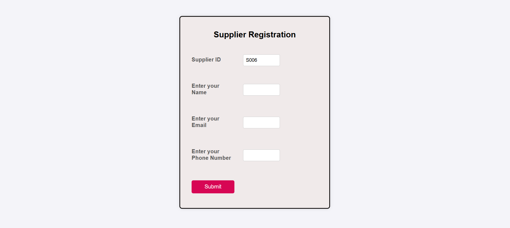
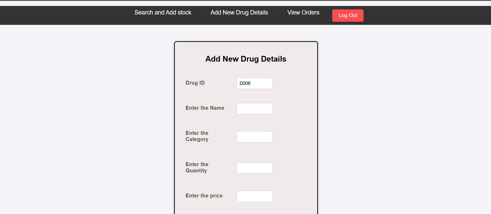
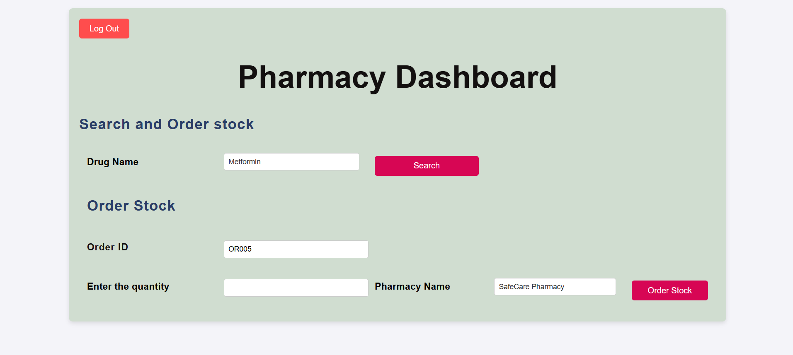
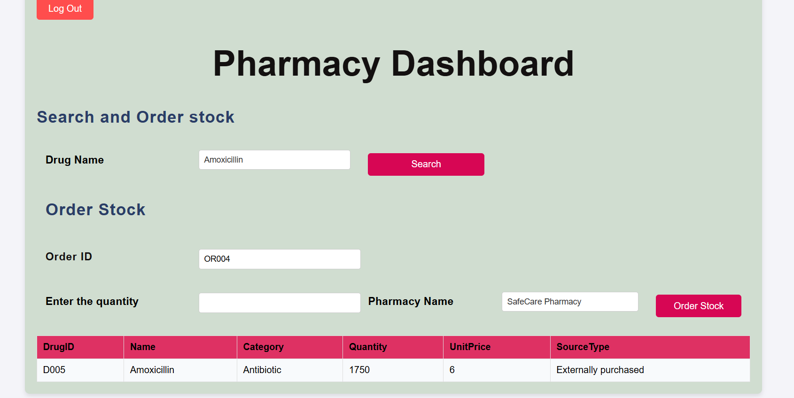
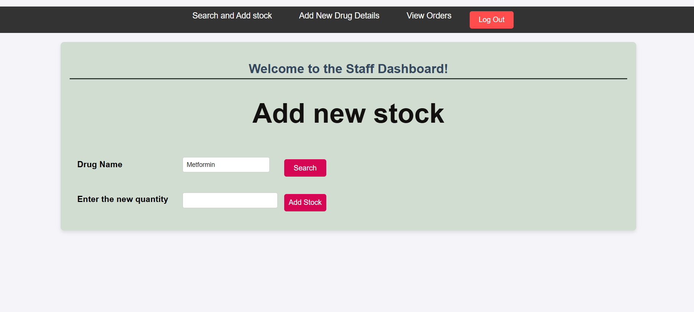
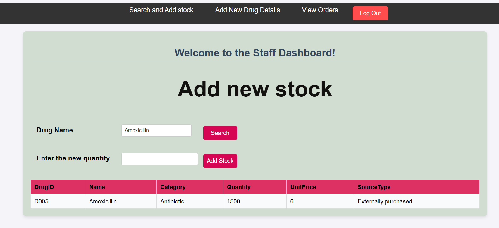
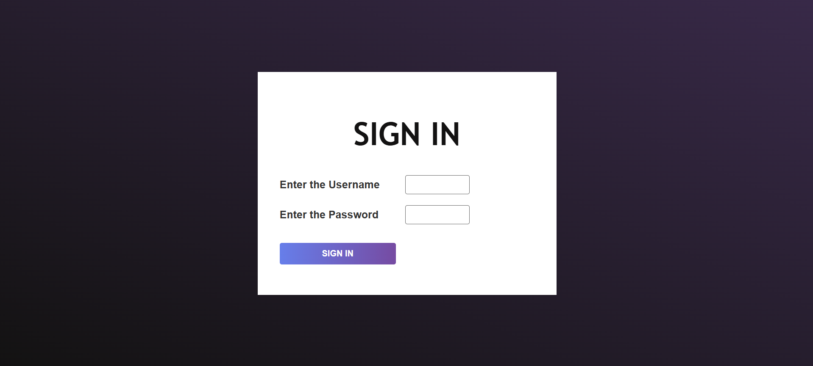
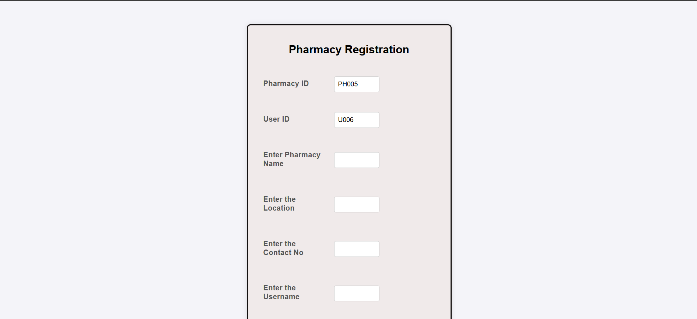
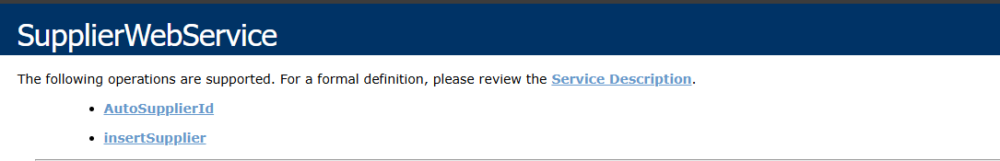

# 💊 State Pharmaceutical Cooperation (SPC) - SOA System  

✨ **A modern SOA solution for pharmaceutical supply chain management**  
*Built with .NET SOAP APIs, MySQL, and cross-platform clients*  

  

---

## 🚀 **Key Features**  

| Feature                | Description                                                                 | Screenshot                          |
|------------------------|-----------------------------------------------------------------------------|-------------------------------------|
| **🧾 Supplier Registration** | Register suppliers via web or SPC branches.                                 |  |
| **📦 Stock Management**     | Real-time inventory updates from plants/warehouses.                         |       |
| **🔍 Drug Search & Order (Pharmacy Dashboard)**  | Pharmacies search/order drugs.                             |        |
| **🔍 Add new stock by Staff** | Staff can search and add and manage new stock directly in the system.                    |   |
| **🔐 Login** | Secure login functionality for different user roles.                               |  |
| **📝 Supplier Registration** | Pharmacies can register via a dedicated form.                                 |   |
---

## **SOAP Web Service Overview**

💡 Our system includes multiple SOAP-based web services. Below is an example of one such service used for supplier registration.

| Name                | Description                                                                 |Method      |  Screenshot                          |
|------------------------|-----------------------------------------------------------------------------|-------------------------------------|-------------------------------------|
| **🧾SupplierWebService** | Provides supplier registration functionality through web or SPC branches. Includes automatic ID generation and supplier data insertion.                                |AutoSupplierId() , InsertSupplier()                                 |  |

## 🛠 **Tech Stack**  

- **🌐 Backend**: `.NET 6 + WCF (SOAP)`  
- **🗃 Database**: `MySQL 
- **📱 Clients**: `ASP.NET Web Application (.NET Framework) 
- **📡 API**: `XML/SOAP` for cross-platform compatibility  

---
